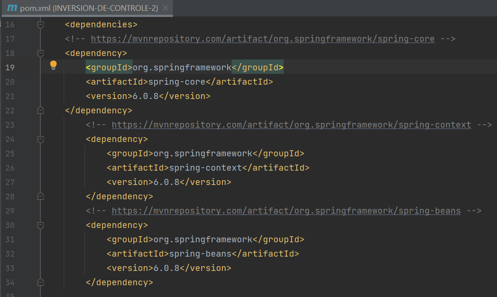
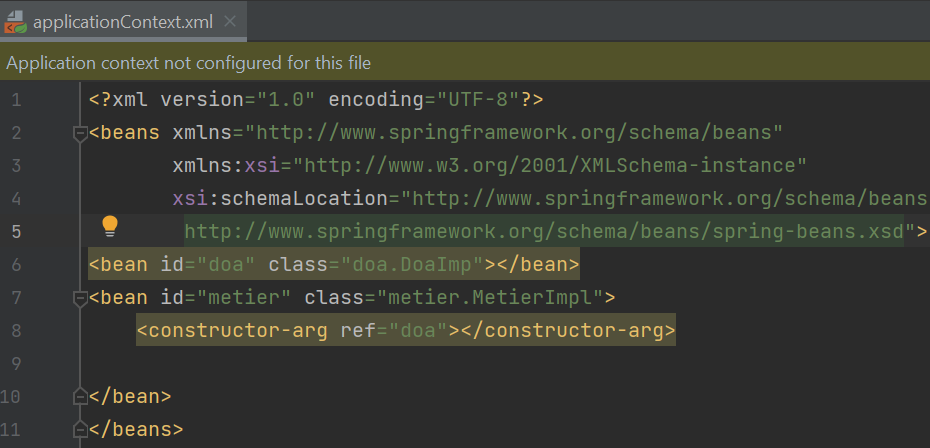
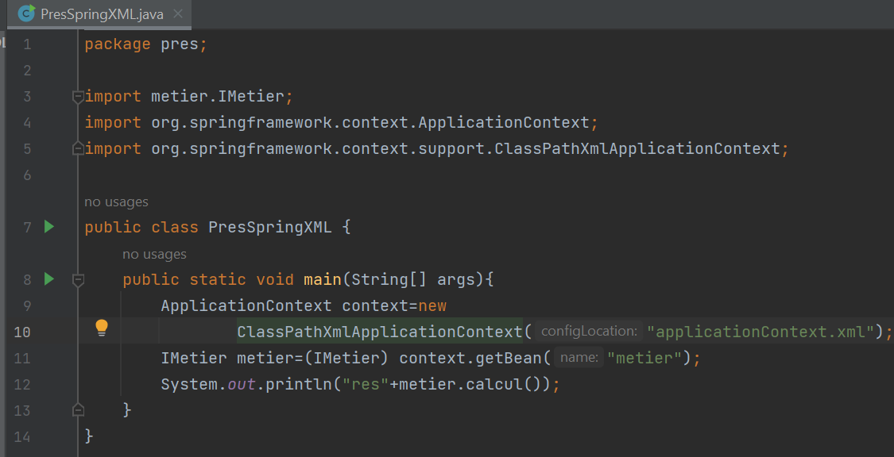
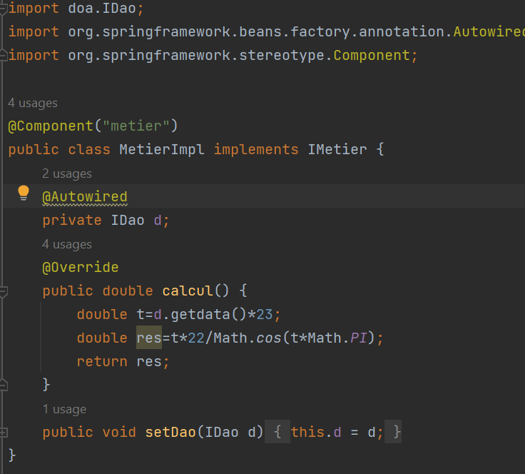
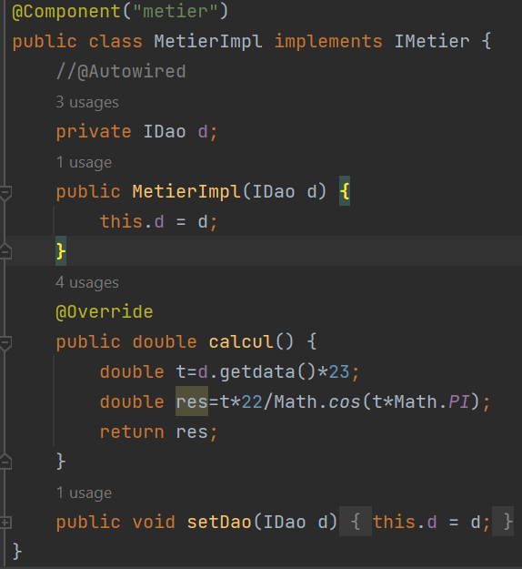
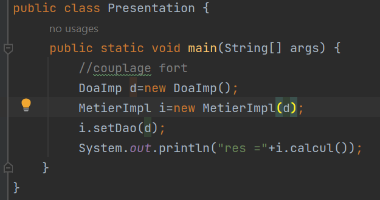
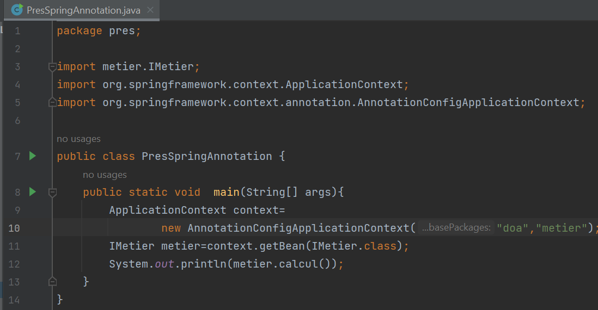

<h2>L'injection des dépendances avec 2 versions XML et Annotations(Framework Spring) </h2>
<h4>Les dépendances (pom.xml)</h4>

<h4>1) L'injection des dépendances à travers le fichier de configuration XML</h4>

<h4>2) L'injection des dépendances En utilisant les annotations</h4>
<h6>L'injection via le setter</h6>

<li>L'injection via le constructeur</li>

<li>classe presentation (version annotations)</li>

